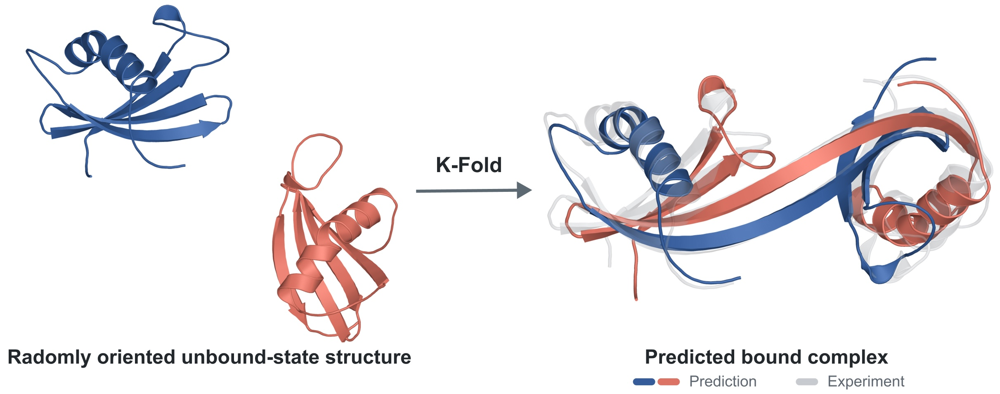

# K-Fold

K-Fold is a biomolecular foundation model that predicts binding-induced conformational changes.
Through an apo-to-holo diffusion bridge, it models how unbound molecules assemble and change shape upon binding, including GPCR and kinase systems.



Preprint will be available soon.

## Model parameters

K-Fold uses pretrained [AtlasLM](https://github.com/SeonghwanSeo/atlasfold) for protein sequence representations and [TriProRep](https://github.com/hsjang0/TriProRep) for protein structure representations.
The parameters for these models and K-Fold are downloaded automatically on first use from [Hugging Face](https://huggingface.co/collections/kaist-ai-bio/k-fold).

## Installation

K-Fold requires Python 3.11 or later.

Install from PyPI:

```bash
pip install kfold
```

Or install from source:

```bash
git clone https://github.com/kaist-ai-bio/kfold.git
cd kfold
pip install -e .
```

## Inference

Run predictions from a YAML or JSON query file, or a directory of query files for bulk runs:

```bash
kfold --input examples/8and.yaml --out-dir predictions/ --seeds 42
```

See `kfold --help`, the [inference guide](docs/inference.md), or the [Python API guide](docs/python_api.md) for details.

By default, K-Fold prepares apo structures with [AtlasFold](https://github.com/SeonghwanSeo/atlasfold), then runs complex structure prediction.
You can also [provide apo structures](docs/inference.md#providing-apo-structures) from experiments or other prediction tools (e.g., AlphaFold2).

**Efficient inference with multiple seeds:**
For multi-seed inference, use `--share-apo-seeds` to generate an apo ensemble for each protein entry and reuse it across all inference seeds.
This is particularly useful for relatively rigid apo structures or runs with many inference seeds; see [automatic apo generation](docs/inference.md#automatic-generation).

```bash
kfold --input examples/ --out-dir predictions/ --share-apo-seeds 1 2 3 --seeds 1 2 3 4 5 6 7 8 9 10
```

**Multi-stage inference:**
Use `--stage apo` to prepare apo structures only, or `--stage complex` to predict complexes from prepared apos:

```bash
kfold --stage apo --input examples/ --out-dir predictions/ --seeds 42
kfold --stage complex --input examples/ --out-dir predictions/ --seeds 42
```

**Kernel selection:**
Use `--kernel {auto,triton,cuequiv,torch}` to select the backend for AtlasFold apo preparation and K-Fold complex prediction.
The default, `auto`, prefers Triton, then cuEquivariance, then PyTorch, depending on availability.

## Training

See the [training guide](docs/training.md) for data preparation, training commands, and configuration.

## Citation

TBA

## Acknowledgements

K-Fold was developed at KAIST as part of the K-Fold initiative supported by the Ministry of Science and ICT (MSIT), Republic of Korea.

Members of Team KAIST are listed below (alphabetical order):

- **Project management:** Hyeongwoo Kim<sup>3,†</sup>
- **Engineering lead:** Seonghwan Seo<sup>3,†</sup>
- **K-Fold architecture:** Seokhyun Moon<sup>3,†</sup>, Jun Hyeong Kim<sup>3</sup>, Shinwoo Kim<sup>3</sup>, Minha Park<sup>3</sup>, Jisu Seo<sup>3</sup>, Mingyeong Shin<sup>3</sup>, Wonho Zhung<sup>3</sup>
- **Protein structure encoder:** Hyosoon Jang<sup>1,†</sup>, Taewon Kim<sup>1,†</sup>, Hyunjin Seo<sup>1</sup>
- **RNA sequence encoder:** Dongki Kim<sup>1,†</sup>, Jun Hyeong Kim<sup>1,†</sup>, Jinheon Baek<sup>1</sup>, Jaehyeong Jo<sup>1</sup>
- **Training data preparation:** Yeongnam Bae<sup>2,†</sup>, Woosung Jeon<sup>2,†</sup>, Joongwon Lee<sup>3,†</sup>, Junyup Lee<sup>2,†</sup>, Yunsu Shin<sup>2,†</sup>, Eugene Choi<sup>2</sup>, Jeong Hun Choi<sup>2</sup>, Hyeongyu Han<sup>2</sup>, Calvin Samuel<sup>2</sup>
- **Kernel optimization:** Youngchan Kim<sup>4</sup>
- **Supervision:** Sungsoo Ahn<sup>1</sup>, Dongsu Han<sup>4,1</sup>, Sung Ju Hwang<sup>1</sup>, Ho Min Kim<sup>2</sup>, Woo Youn Kim<sup>3</sup>, Gyu Rie Lee<sup>2</sup>, Byung-Ha Oh<sup>2</sup>

<sup>†</sup> Core contributor; <sup>1</sup> KAIST AI; <sup>2</sup> KAIST Biological Sciences; <sup>3</sup> KAIST Chemistry; <sup>4</sup> KAIST Electrical Engineering.

We thank our collaborators at [HITS](https://hits.ai) for their contributions to K-Fold.

## License

Copyright © 2026 Korea Advanced Institute of Science and Technology (KAIST).

K-Fold source code and model weights are licensed under the [Apache License 2.0](LICENSE).
